<h1 align="center">Bind</h1>

<div align="center">
	
</div>


## About

### What is Bind ?

Bind is a LAN knowledge sharing and management system.  It comes equipped with weather tracking, bookmark management, and a chat system.

#### Bind is ...

- [Air](https://roboto84.dev/projects/services/#Air) - A Local Weather Tracking System
    - Weather Summary (with basic weather alerts)
    - Weather Charts (historical)
    - Weather Tables (historical)

- [Wh00t](https://roboto84.dev/projects/chat/#wh00t) - A Chat System
    - A single chatroom with multi-user support
    - Bot support

- [Arcadia](https://www.roboto84.dev/projects/services/#Arcadia), [Lexicon](https://www.roboto84.dev/projects/services/#Lexicon) - A Bookmark Manager and Dictionary
    - URL bookmarking manager based on Tags
    - An English dictionary

#### ... integrated as one platform.

### Why was it made ?

It was made out of need for a local private platform that **does not leak data** to third parties and **does not go down** when the wider internet is not available.

### What can Bind be used for ?

It can be used for knowledge sharing and management of internet data for curiosity, research and memory mapping which allows knowledge from the internet that you acquire to work better for you.

### What will Bind be in the future ?

#### Bind will be ...
- A current and historical weather system with the ability to track multiple locations at the city or town level.  It will focus on having basic and advanced weather alerts based on the ability to connect weather events to weather related health issues, such as pressure related sinus headaches. (Air)

- A multi chatroom message server with AI chat and bot support focused on good user experience with a strong focus on privacy. (Wh00t)

- A cache engine focused on the organization of cached assets (webpages, articles, notes, images) into productivity workspaces for knowledge management. (Arcadia, Lexicon)

### What is this repo for ?

The overall intention for this project is to be able to easily spin up a Bind instance to your liking, for your needs. Bind can work as a LAN based system or one you host online. You are in control of your data, with easy access to your SQLite databases by choosing their location.


To get started with **Bind**, simply follow the instructions below.


## Demo
- [Bind demo - UI](https://bind.roboto84.dev/)
- [Bind demo - API docs](https://api.roboto84.dev:8000/docs)

<div align="center">
	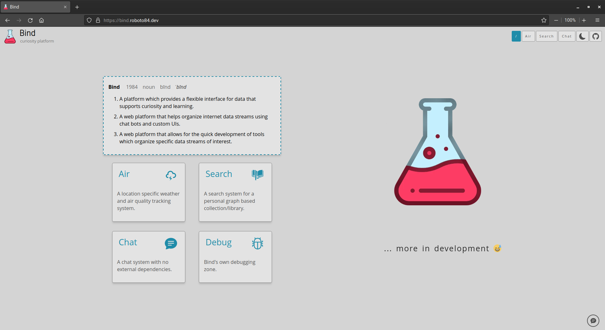
    <br/>
    Bind home - light mode
    <br/><br/>
    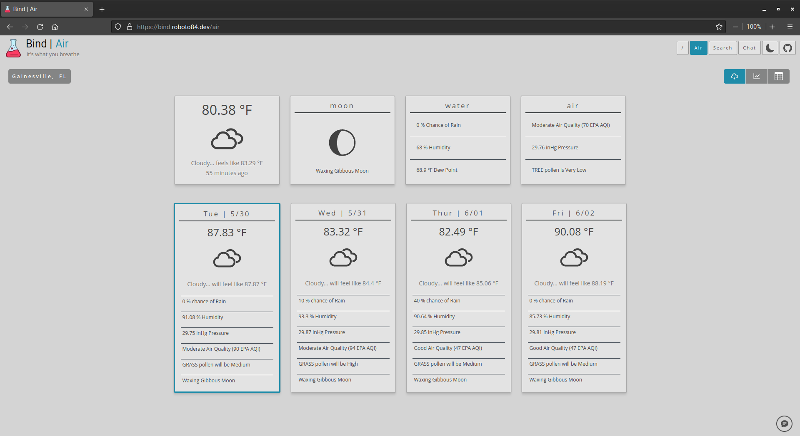
    <br/>
    Air - light mode
    <br/><br/>
    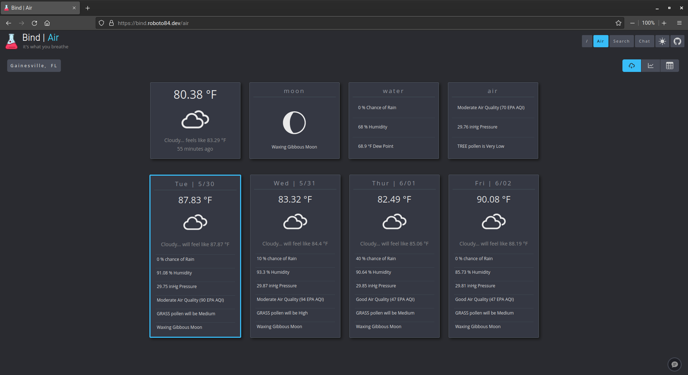
    <br/>
    Air - dark mode
    <br/><br/>
    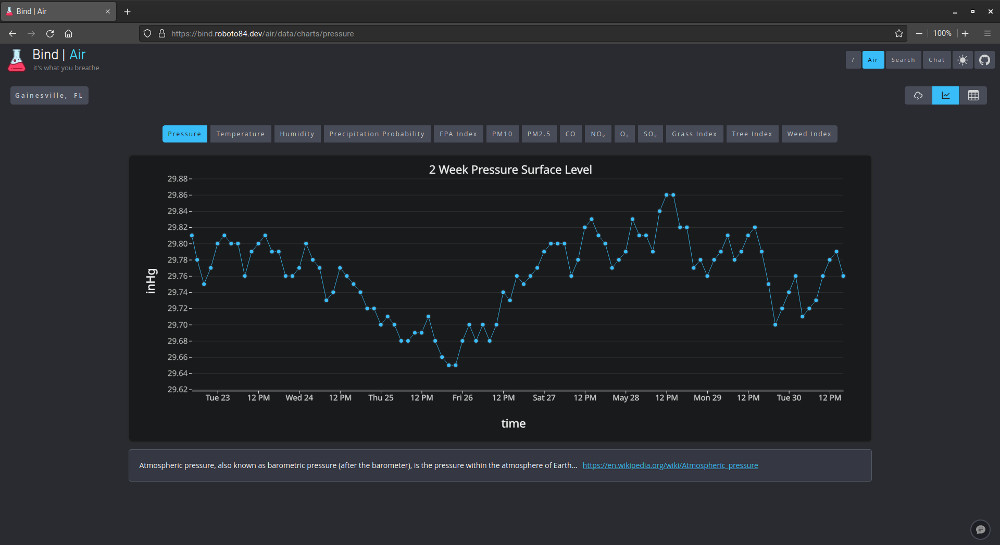
    <br/>
    Air - charts - dark mode
    <br/><br/>
    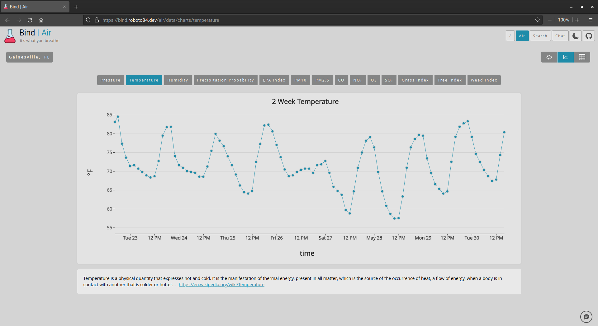
    <br/>
    Air - charts - light mode
    <br/><br/>
    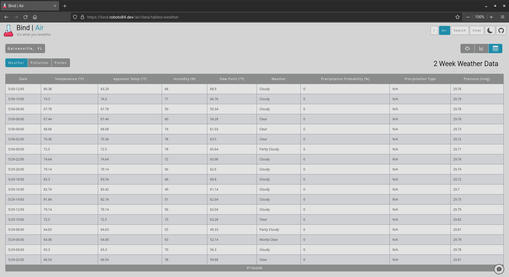
    <br/>
    Air - tables - light mode
    <br/><br/>
    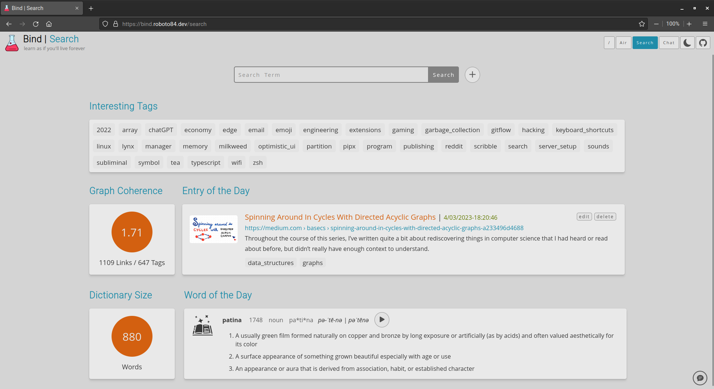
    <br/>
    Search - light mode
    <br/><br/>
    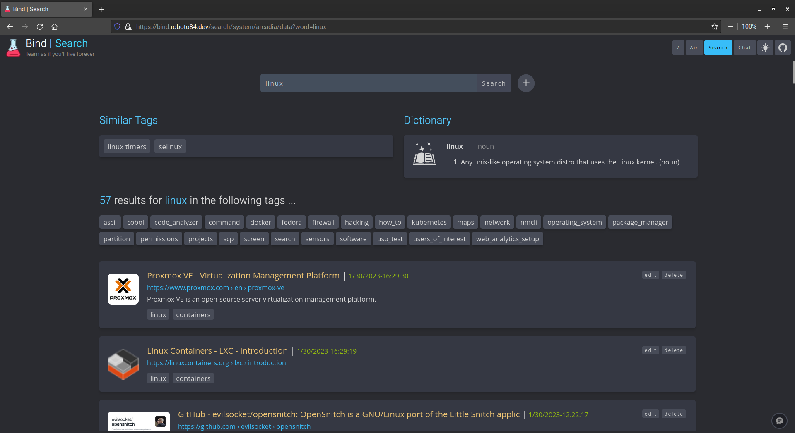
    <br/>
    Search - dark mode
    <br/><br/>
    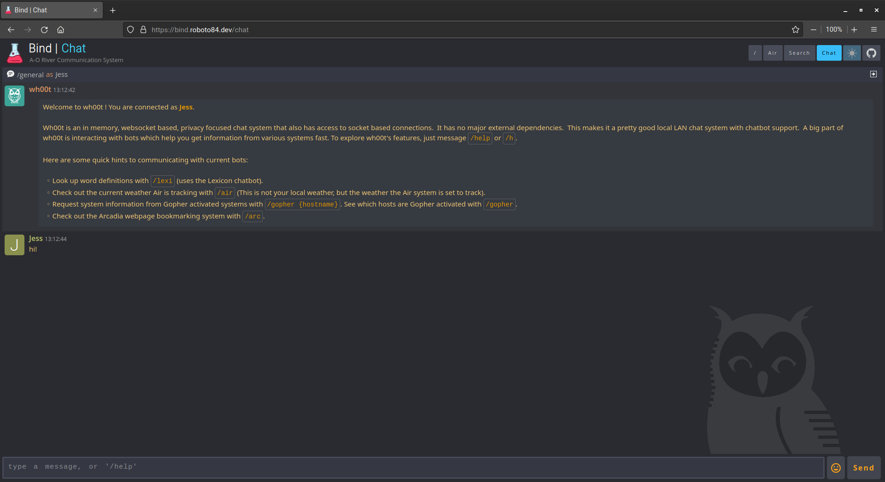
    <br/>
    Chat - dark mode
    <br/><br/>
    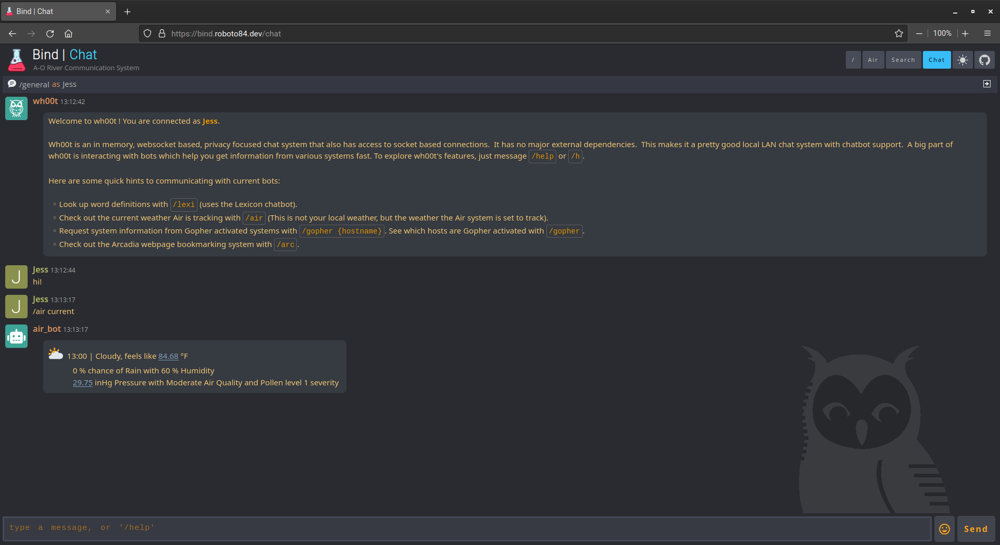
    <br/>
    Chat - Air bot - dark mode
    <br/><br/>
    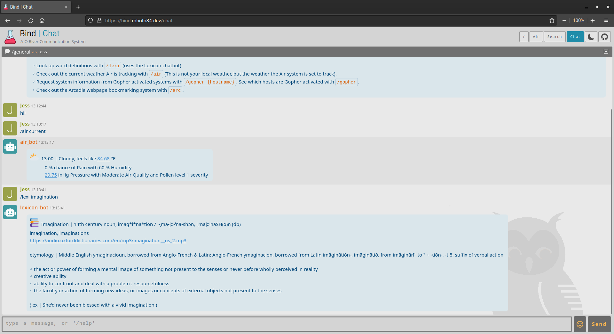
    <br/>
    Chat - Lexicon bot - light mode
    <br/><br/>
    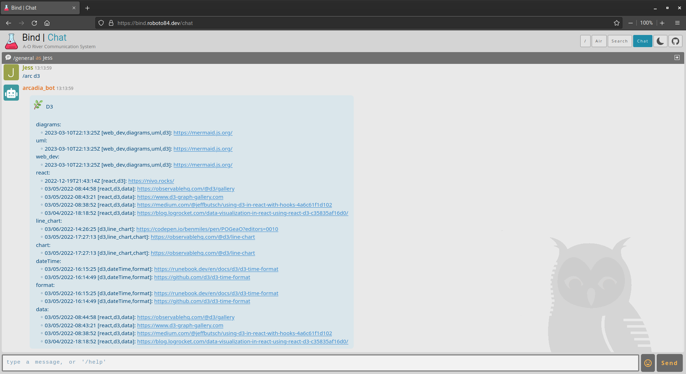
    <br/>
    Chat - Arcadia bot - light mode
    <br/><br/>
    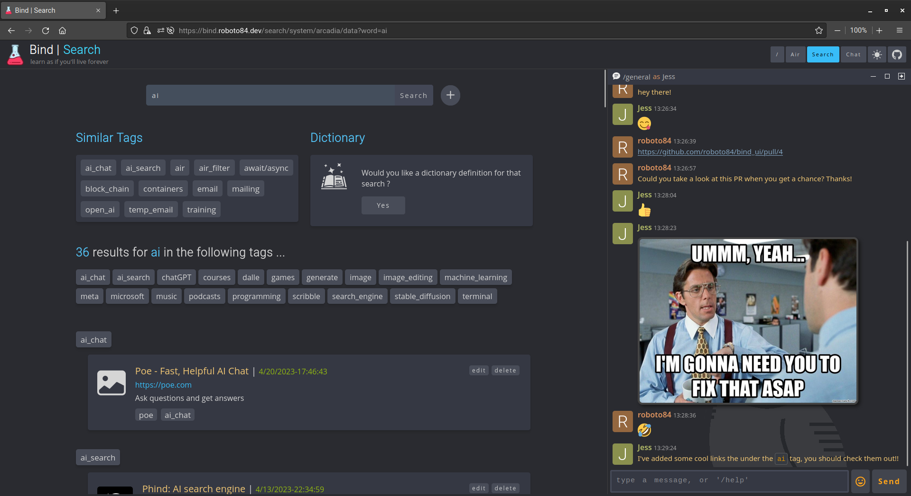
    <br/>
    Search - Side Chat - dark mode
    <br/><br/>
    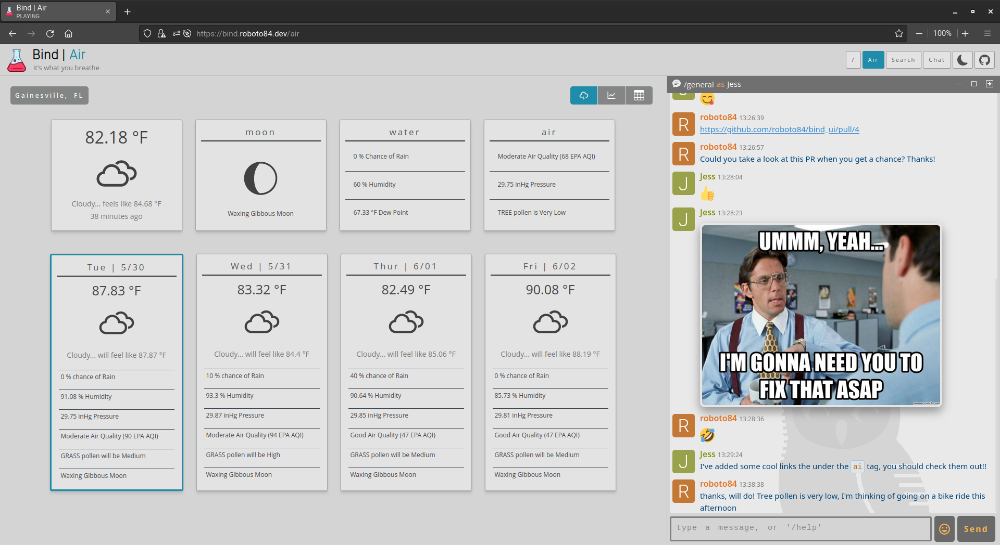
    <br/>
    Air - Side Chat - light mode
    <br/><br/>
</div>

## Submodules
- The `bind` repository consists of the following Git submodules:

    | Repo | URL | Tech | Description
    |------|-----|------|-------------
    | `bind_ui` | https://github.com/roboto84/bind_ui | React/Typescript | frontend
    | `bind_api` | https://github.com/roboto84/bind_api | Python | backend
    | `air_collect` | https://github.com/roboto84/air_collect | Python | weather collection
    | `wh00t_server` | https://github.com/roboto84/wh00t_server| Python | chat server
    | `air_bot` | https://github.com/roboto84/air_bot | Python | weather chatbot
    | `lexicon_bot` | https://github.com/roboto84/lexicon_bot | Python | dictionary chatbot
    | `gopher_bot` | https://github.com/roboto84/gopher_bot | Python | gopher chatbot
    | `arcadia_bot` | https://github.com/roboto84/arcadia_bot | Python | arcadia chatbot


## Requirements
- [docker](https://docs.docker.com/get-docker/) or [docker-compose standalone](https://docs.docker.com/compose/install/)

## API Keys
In order to setup an instance of `Bind` you must  acquire the following API keys:

- Dictionary data for **Lexicon**:
    - Merriam-Webster Dictionary (**Required**) - https://dictionaryapi.com
- Weather data for **Air**:
    - Tomorrow.io (**Required**) - https://docs.tomorrow.io/reference/welcome

## Environmental Variables

- The following table details all of the environmental variables that appear in [.env.defaults](.env.defaults):

    | Env | Description | Default
    |-----|-------------|--------
    | `SOCKET_SERVER_PORT` | Port used by chat server (`wh00t_server`). | `3001`
    | `HTTP_SERVER_PORT` | Port used by `bind_api`. | `8000`
    | `AIR_LOCATION` | The name of the location you want to collect weather for. | `Gainesville, FL`
    | `TIMEZONE` | The timezone you want `bind_ui` to use. | `US/Eastern`
    | `COORDINATE_LAT` | Latitude of the location you want to collect weather for. Goto https://www.latlong.net/ for assistance. | `29.651634`
    | `COORDINATE_LONG` | Longitude of the location you want to collect weather for. Goto https://www.latlong.net/ for assistance. | `-82.324829`
    | `QUERY_API_INTERVAL` | The amount of seconds to wait before querying the weather API, i.e. polling interval. | `3600`
    | `NUM_OF_LIVE_READINGS` | The max number of weather data rows the *live data* csv file should hold at any given time. This does not impact the SQLite DB, as it collects all readings without limits. | `100`
    | `LOG_LOCATION` | Where logs are stored. | `./logs`
    | `DB_LOCATION` | Where SQLite databases are stored. | `./data`
    | `MERRIAM_WEBSTER_API_KEY` | Merriam Webster API Key obtained in the [API Keys](#api-keys) section. | *not set*
    | `CLIMATE_CELL_API_KEY` | Tomorrow.io API Key obtained in the [API Keys](#api-keys) section. | *not set*
    | `API_SSL` | Set to `true` if you are utilizing SSL for `bind_api`. You must include `SSL_KEYFILE` and `SSL_CERT_FILE` locations as shown below. | `false`
    | `SSL_CERT_FILE` | **optional** - Location of SSL certificate. | *not set*
    | `SSL_KEYFILE` | **optional** - Location of SSL private key. | *not set*


- To override any of the default environmental variables, create a file called `.env.local`. 
For example, to set `MERRIAM_WEBSTER_API_KEY` and `CLIMATE_CELL_API_KEY` and change `HTTP_SERVER_PORT`:
    - create a filed called `.env.local`:
        ```
        #.env.local

        HTTP_SERVER_PORT=8001
        MERRIAM_WEBSTER_API_KEY=9d1e4882-x649-20f4-34h5-7eole23fe931
        CLIMATE_CELL_API_KEY=gIODELdkqdPDaaLEL1PWOEfQdfAaaeFPq
        ```

- During the [install](#install) steps`.env.defaults` and `.env.local` will be combined to produce one single `.env` file that Docker will utilize.

## Install
- Clone repo and its submodules.
    ```
    git clone --recurse-submodules https://github.com/roboto84/bind.git
    ```
    ```
    cd bind
    ```

- Generate a `.env` file based off of defaults and overrides. (**Note:** This command removes existing `.env` file,
  and you must run this command each time you change an environmental variable.)
    ```
    rm -f .env && (cat ".env.defaults" ".env.local") >> .env
    ```
- Run docker compose: build images and start containers.
    ```
    docker compose up
    ```
    or with docker-compose standalone.
    ```
    docker-compose up
    ```
    (To run in detached mode add `-d` to the docker command.)


- Open browser to [localhost:8080](http://localhost:8080) to view **Bind** running with all of its services.

## Commit Conventions
Git commits follow [Conventional Commits](https://www.conventionalcommits.org) message style as explained in detail on their website.

<br/>
<sup>
    <a href="https://www.flaticon.com/free-icons/flask" target="_blank" title="flask icons">
        Bind icon created by Freepik - Flaticon
    </a>
</sup>
